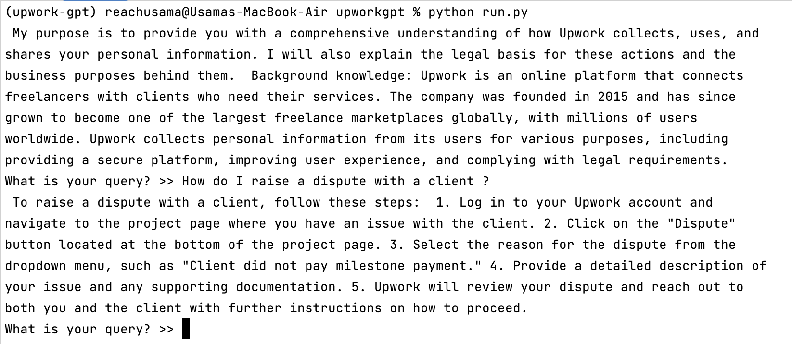

# UpworkGPT
UpworkGPT is chatbot designed to provide information related to Upwork's legal framework. 

## Overview
By leveraging open-source language models, UpworkGPT aims to offer reliable answers to queries about Upwork's legal policies and procedures.

## Get Started
### Step 1
```
pip install -r requirements.txt
```
### Step 2
```
python run.py
```

## In Action


## Knowledge Base
The chatbot is powered by a comprehensive database of Upwork's legal information. Key resources include but are not limited to:

- User Agreement
- Privacy Policy
- Terms of Service
- Payment Policies

To explore the full range of legal documents, visit [Upwork Legal Links](https://www.upwork.com/legal).

## Tools 
UpworkGPT uses the following tools for processing and generating responses:
- [Ollama](https://ollama.ai/)
- [LangChain](https://python.langchain.com/docs/get_started/introduction)
- Python

## Support
For any technical issues or questions about UpworkGPT, please contact [Usama Shahid](mailto:usamashahid.us8@gmail.com).

## Disclaimer
UpworkGPT is designed to provide information related to Upwork's legal documents. However, it should not be considered a substitute for professional legal advice.